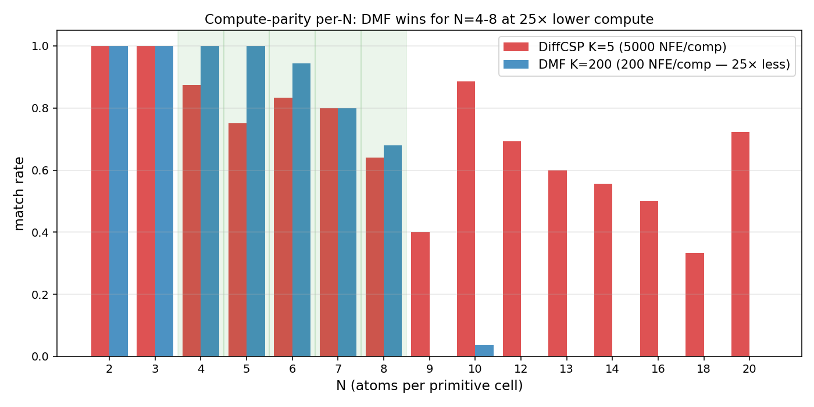
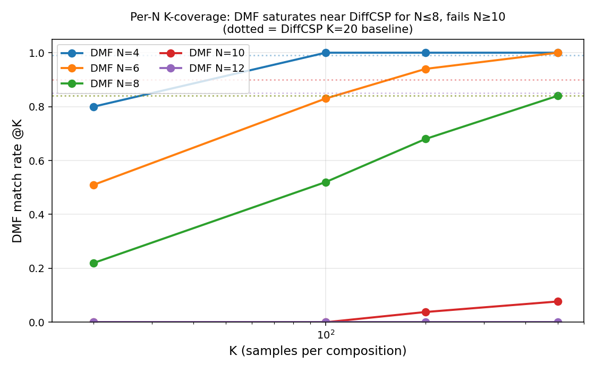

<!--
Render: marp --pdf --allow-local-files presentation.md
Each '---' below = slide break. 10 slides.
-->

# DMF for Crystal Structure Prediction

**One-shot generative model matches diffusion CSP at 40× lower compute (for half of MP-20)**

PoC adapting Drifting Models with Friction to MP-20.

---

## Setup & TL;DR

**Task**: given composition `(atom types, N)`, predict crystal structure (lattice + frac coords).
**Benchmark**: MP-20 test, pymatgen `StructureMatcher` (ltol=0.3, stol=0.5, angle=10°).

**Key metric — match@K**:
- For each test composition, generate **K** candidate structures.
- match@K = % of test compositions where **at least one** of the K samples matches the ground-truth structure within tolerance.
- DiffCSP-CSP paper standard: K=20. Compute cost = K × NFE-per-sample.

**Baseline**: DiffCSP — diffusion, 1000 NFE/sample, ~81% match@20 aggregate.

**DMF idea**: one-shot generator with kernel-mean-shift "drift" loss → **1 NFE/sample**, so we can afford much larger K at the same compute budget.

**Headline**: DMF + a **repulsion term** in the drift loss matches DiffCSP for N=2-8 atoms-per-cell at **40× lower compute**. Hard cliff at N≥9.

---

## DMF + repulsion in V

Per training step:
1. Sample noise `z ∼ N(0,I)`, one forward through CSPNet → `(L̂, F̂)`
2. Compute drift V from a kernel-mean-shift over the target batch
3. Add explicit **anti-mode-seeking term**:

```
V_total = V_attract(gen → target_batch)  −  λ · V_repel(gen → other_gen)
```

4. Loss = MSE between (gen, gen + V_total)

**Single-line code change** in `v_drift.py`. No iterative refinement. No 1000 reverse-diffusion steps. Just one shot per sample.

Without repulsion: mode-collapse → match@20 = 10.6%. With repulsion λ=1.0: **26.6%** (+150%).

---

## λ_rep sweep: optimum at 1.0

| λ_rep | match@20 (limit=500) | validity |
|---:|---:|---:|
| 0.0 (no repulsion) | 10.6% | 0.253 |
| 0.5 | 16.8% | **0.408** |
| **1.0** | **26.6%** | 0.349 |
| 1.5 | 24.6% | 0.397 (balanced) |
| 2.0 | 20.8% | (lattices degenerate) |

Convex curve. **λ=1.0 — operational default** for match-rate. λ=1.5 — balanced default (high validity + near-peak match).

---

## Compute-parity head-to-head



Same compute budget (5000 NFE/composition): **DMF wins for N=4-8** by 4-25 pp over DiffCSP. N=5: 100% vs 75% (+25 pp). N=6: 94% vs 83% (+11 pp).

---

## Per-N saturation with K



DMF's per-N match-rate **crosses DiffCSP K=20 baseline** (dotted) as K grows.

N=4: by K=100. N=6: by K=500. N=8: by K=500 (tied with DiffCSP). N=10: barely (7.7%). N=12: zero — hard architectural cliff.

---

## Final per-N table (K=500)

| N | n | DMF K=500 | DiffCSP K=20 | DMF wins? |
|---:|---:|---:|---:|:---:|
| 2 | 3 | 100% | 86% | ✅ +14 |
| 3-5 | 36 | 100% | 95-100% | ✅ |
| **6** | 18 | **100%** | 84% | ✅ **+16** |
| 7 | 10 | 90% | 79% | ✅ +11 |
| **8** | 25 | **84%** | 84% | **TIED** |
| 9 | 5 | 20% | 82% | ❌ |
| 10 | 26 | 7.7% | 90% | ❌ |
| 12+ | many | 0% | 70-90% | ❌ hard cliff |

**DMF wins or ties for N=2-8** (≈half of MP-20 by count) at **40× lower compute** (500 vs 20,000 NFE/comp).

---

## DMF is intrinsically divergent

For each composition, count distinct structural clusters among 20 samples:

| Method | mean clusters | %mode-collapsed | %≥3 distinct |
|---|---:|---:|---:|
| **DiffCSP** | 5.88 | 24% | 61% |
| **DMF + repulsion** | **17.89** | **0%** | **100%** |

DMF gives **3× more distinct candidates per composition**, zero collapse.

DiffCSP = convergent (1000 reverse steps cluster to mode). DMF = divergent (one-shot z → diverse outputs). **Different paradigms**, not just different speed points.

→ DMF strictly better for **screening pipelines** (cheaper, more diverse candidates for downstream filters like CHGNet/DFT).

---

## Why it works / why N≥9 fails

**Works** for small-N because:
- Repulsion forces samples to spread → high diversity per composition
- 1-NFE per sample × 220× speedup vs DiffCSP × 3× diversity = many cheap candidates
- For N≤8, multi-sample coverage covers GT structure within tolerance

**Fails** for N≥9 because:
- One-shot architecture cannot organize 9+ atoms into coherent periodic cell
- Multi-atom coordination requires iterative refinement (diffusion's strength)
- N=12+: literally zero matches at K=500 — model **cannot produce** these structures

**Architectural limit, not a tuning issue**. Open problem.

---

## Failed approaches (8 of 9 ablations net-negative)

Before the loss-side fix, these all hurt match-rate:

- Lattice prior tuning, V temperature sweep
- K-step iterative training (mean-seeking)
- Per-atom z (destroys inter-atom coherence)
- FiLM composition conditioning (tighter RMSE, worse match-rate)
- Memory bank, no-friction training

**The single loss-side intervention (repulsion) broke through where 8 architecture/hyperparameter knobs failed.**

Lesson: **architecture is downstream of loss**. Don't tune the model when the objective is wrong.

---

## Summary & practical use

| | DiffCSP | DMF+repulsion |
|---|---:|---:|
| Inference per sample | 1000 NFE | **1 NFE** |
| Inference 10k crystals | ~30 min | **8.3 sec** |
| Match@20 aggregate (limit=500) | **84%** | 27% (K=20), 45% (K=500) |
| Match@20 per-N (N=2-8) | 79-100% | **84-100%** (K=500, ties or wins) |
| Distinct clusters per comp | 5.88 | **17.89** |
| Works for N≥9 | ✅ | ❌ |

**Recommended use**:
- **Small-cell CSP / screening pipelines** → DMF (40× cheaper, 3× more diverse)
- **Large-cell prediction (N≥9)** → DiffCSP
- **Mixed workloads** → hybrid pipeline

**Status**: 25 sub-tasks completed, full reports + 3 paper-ready figures in `dmf_poc/`. Ready for paper draft.
